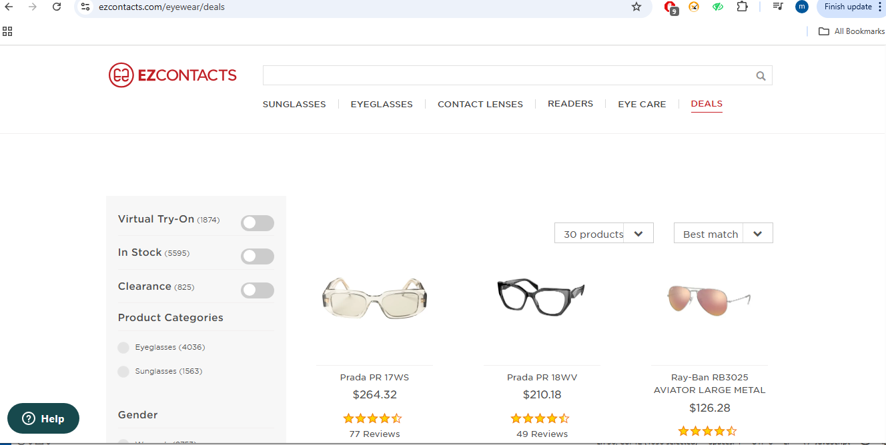
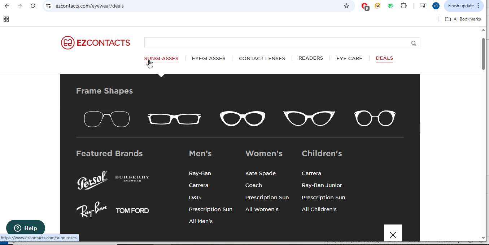
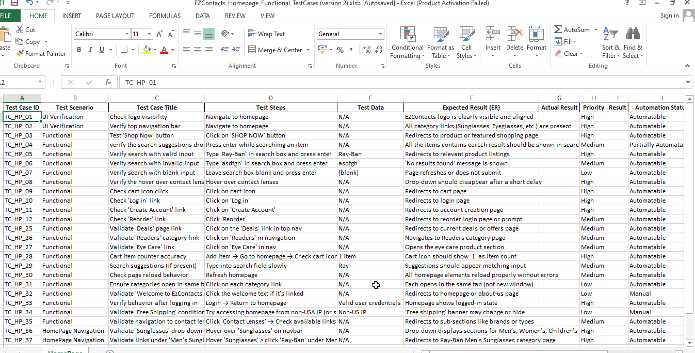
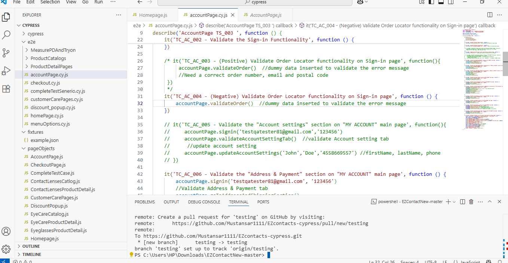

# EZContacts Cypress Automation Suite

This repository contains a comprehensive end-to-end Cypress automation test suite for the **EZContacts** eCommerce platform. The project showcases a full QA implementation using Page Object Model (POM), clean branching strategy, modular structure, and real-world test scenarios.

---

## 📸 Project UI Snapshots

| Homepage UI                 | Deals Page                  | Navigation Menu             |
| --------------------------- | --------------------------- | --------------------------- |
|  |  |  |

| Test Case Design (Excel)    | Cypress Code View           |
| --------------------------- | --------------------------- |
|  |  |

---

## 🚀 Features Covered

* Homepage & Navigation Menus
* Product Detail Pages (Eyewear, Contact Lenses, Readers, Eye Care)
* Catalog Filter Validations
* Sign-in, Account, Order Tracking
* Cart & Checkout Flows
* Measure PD Tool (iframe)
* Virtual Try-On (iframe interaction)
* Discount Popups & Footer Links
* Complete Purchase Workflows

---

## 📁 Project Structure

```
EZcontacts-cypress/
├── cypress/
│   ├── e2e/
│   │   ├── MeasurePDAndTryon/
│   │   ├── ProductCatalogs/
│   │   ├── ProductDetailPages/
│   │   └── ... (other test specs)
│   ├── fixtures/             # Sample test data
│   ├── pageObjects/          # POM class files
│   └── support/              # Commands & global hooks
├── screenshots/              # Visual documentation
├── cypress.config.js         # Cypress config
├── package.json              # Dependencies
├── .gitignore
└── README.md
```

---

## 🧪 Getting Started

### 1. Clone the Repo

```bash
git clone https://github.com/Mustansar1111/EZcontacts-cypress.git
```

### 2. Install Dependencies

```bash
npm install
```

### 3. Run Tests (GUI)

```bash
npx cypress open
```

### 4. Run Tests (Headless CLI)

```bash
npx cypress run
```

---

## 🔀 Branching Strategy

* **`main`** — Clean & production-ready test base
* **`testing`** — Active development branch for new test cases or changes

> Create feature branches from `testing`, then merge via PRs after test review.

---

## 🧠 QA Strategy Highlights

* ✔ Page Object Model (POM)
* ✔ Cypress Iframe for embedded tools (VTO, Measure PD)
* ✔ Full product journey automation (selection → cart → checkout)
* ✔ Test case mapping from Excel to Cypress
* ✔ Named test case IDs (TC\_HP\_01, TC\_PD\_05, etc.)

---

## ⚙️ CI & Reporting

### 🔁 GitHub Actions Integration

This project includes a `.github/workflows/cypress.yml` file to enable CI test runs on every push or pull request:

```yaml
name: Cypress Tests
on: [push, pull_request]
jobs:
  cypress-run:
    runs-on: ubuntu-latest
    steps:
      - uses: actions/checkout@v3
      - name: Setup Node.js
        uses: actions/setup-node@v3
        with:
          node-version: 18
      - run: npm install
      - run: npx cypress run
```

### 📊 HTML Reports via Mochawesome

To generate detailed visual test reports:

```bash
npm install mochawesome --save-dev
npx cypress run --reporter mochawesome
```

Reports are saved in the `mochawesome-report/` folder.

---

## 👤 Author

**Izhan** – QA Automation Engineer
💼 Portfolio: In Progress
🌱 Skills: Cypress, JavaScript, Manual+Automation Testing, Git, CI/CD


---

## 📜 License

This project is licensed under the MIT License.
